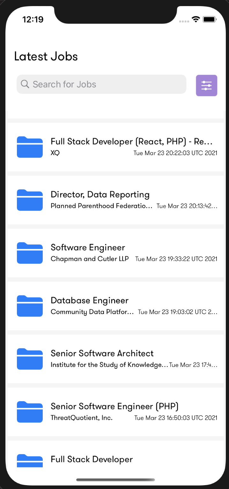
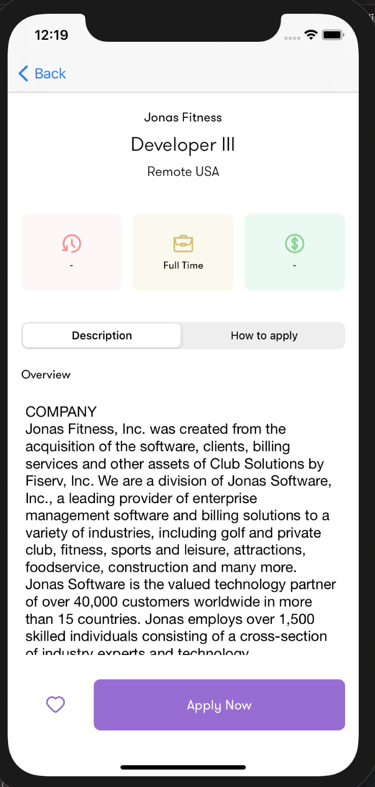
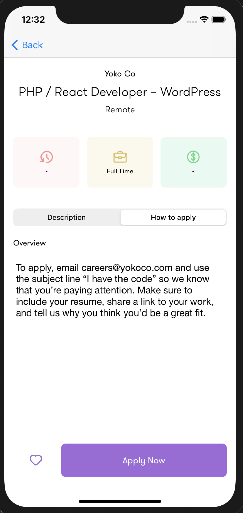

## GithubJobs

This is a Simple iOS Application listing jobs from Github Jobs API. Design adapted from : [ Arotec Digital](https://dribbble.com/shots/12792161-Gigson-Free-UI-Template)


Screenshots





### Setup

Setup is quite simple:

```bash
$ git clone https://github.com/DevAgani/GithubJobs.git 
$ cd GithubJobs 
```
> This will get you a local copy of the project. All you need to do is open xcode and run the application

### Pre-requisites

1. Working knowledge of Swift
2. Working knowledge of RESTful endpoints

Enjoy!

